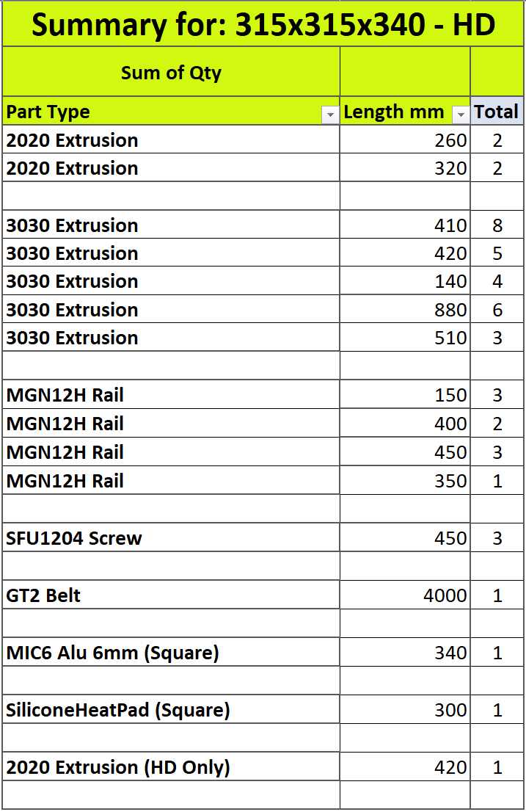

# Frame Size Calculation

## Ordering

The Excel sheet will help you to figure out the exact dimensions and quantity of extrusion you need to order.
It will also define the rails, ballscrews, bed plate and heater pad size you need for that size.  
Since rails and ballscrew can only be ordered into preset dimensions, please ensure that the print size you select will give you standard rail and screw size.

Proposed sizes can be found into the Calculator.

[>Frame & Friends Calculator<](../assets/references/frame/FrameCalculator.xlsx)

## How to use the Frame Calculator

### 1. Enter your desired print area dimension

|INFO|
Only enter dimensions for X-Axis & Z-Axis

> Y-Axis will be filled in automatically
> > X and Y ratio have to be kept at 1:1 doe to the Bed-Arms angle.
> >
> > They are pointing the exact center of the bed by design, changing the XY ratio will affect this center point

|INFO|

> NEW! Selection box for gantry type (STD/HT or HD)
> Will now trigger selection of certain option lines. Summary table will reflect this selection.

|WARNING|
HD print area will be smaller due to wider Y carriages and bigger print head.
around 35mm will be amputed to X and Y.
|WARNING|

### 2. Refresh the pivot table

#### Right-Click on the pivot table and select *Refresh*.

### EXAMPLES
Here are a couple of snapshots from results of recommended sizes:

| STD/HT X315 Y315 Z340                                     | STD/HT X415 Y415 Z440                                     | HD X315 Y315 Z340                                           | HD X415 Y415 Z440                                           |
|-----------------------------------------------------------|-----------------------------------------------------------|-------------------------------------------------------------|-------------------------------------------------------------|
|  |  |  |  |